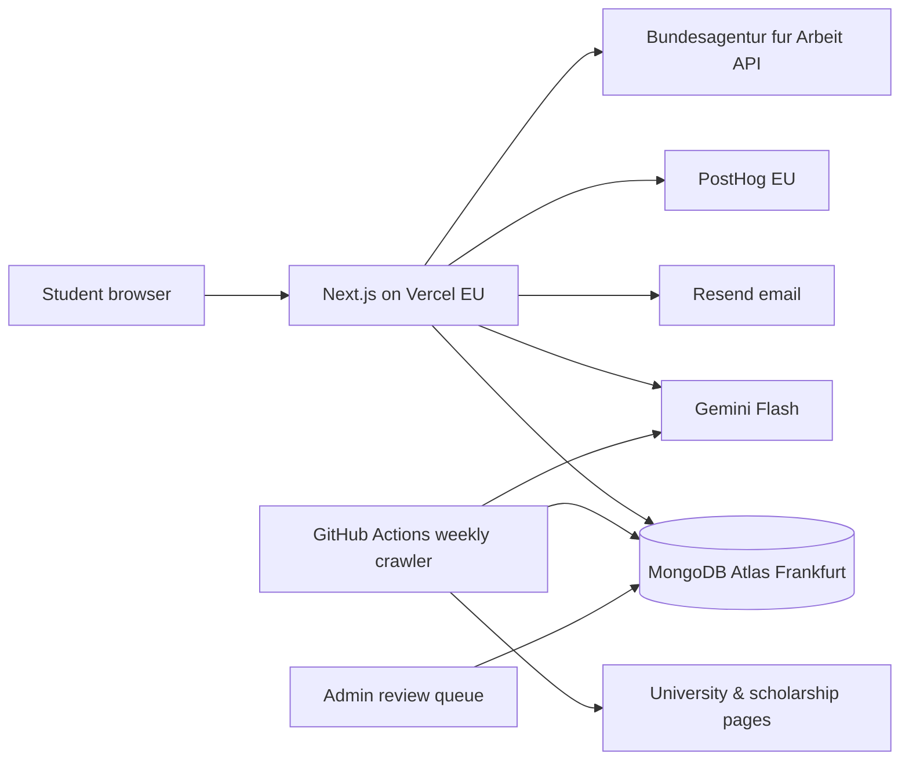

# Technical Approach

Final stack decisions happen in Phase 4. This file captures the direction agreed so far.

## Matching engine (no AI needed to decide)
1. **Hard filters (code):** HZB eligibility for the student's country & qualification, degree level, language requirement met (or met by planned test date), deadline still reachable, prerequisite credits for Master's.
2. **Soft score (code):** field fit, German-converted grade vs. program's typical intake, cost, city/state preference, English-taught, career outcomes.
3. **AI layer:** writes plain-language explanations only. Never invents facts.

**Tiers:** Reach / Match / Safety with visible reasons. No acceptance % until we collect real outcome data.

**Grade conversion — modified Bavarian formula:**
German grade = 1 + 3 × (Nmax − Nd) / (Nmax − Nmin)
(Nmax = best possible grade, Nmin = minimum pass grade, Nd = student's grade)

Matching is cheap code, so it runs **live and unlimited** whenever the profile changes.

## AI Advisor design
- Answers through **tools** that query our database: `search_programs`, `check_eligibility(profile, program)`, `get_deadlines`, `list_scholarships`, `get_document_checklist`.
- **Retrieval** (MongoDB Atlas Vector Search) over a curated knowledge base: APS, blocked account, visa, uni-assist, anabin, Studienkolleg guides.
- Every factual answer cites source + last verified date.
- Missing data → "I don't have verified information" + offer a human consultant.
- Test set of known questions/answers to measure accuracy before release.

## Cost control
- Small fast model (Gemini Flash / GPT mini class) for chat and extraction.
- Stronger model only for paid features (SOP/motivation letter review).
- Cache common answers; generate match explanations once per profile + program.
- Web search APIs (Tavily, Exa) used **at data-ingestion time**, not during chat.
- Matching and alerts = plain code, ~zero AI cost.

## APIs & services

| Need | Option | Cost |
|---|---|---|
| Ausbildung places, occupations | Bundesagentur für Arbeit Jobsuche + BERUFENET (bund.dev) | Free |
| University metadata | Wikidata SPARQL, ROR, HRK open data | Free |
| Research profiles (PhD, later) | OpenAlex | Free |
| Translation | DeepL API | Free tier, then paid |
| Document OCR | Gemini Flash vision, or Azure Document Intelligence / AWS Textract | Low per page |
| Page crawling & change detection | Firecrawl / own crawler | Low |
| Email & alerts | Resend + scheduled jobs | Free tier |
| Partners | Blocked account & insurance affiliate links/APIs | Revenue |

**No public API:** DAAD, anabin, uni-assist, most scholarship databases → own curation + partnership talks.
**No third-party score verification:** IELTS/ETS verify for universities only → OCR + manual check on our side.

## Tech stack (decided 2026-10-05)

| Layer | Choice |
|---|---|
| Framework | Next.js (App Router) + React |
| Styling / UI | Tailwind CSS + shadcn/ui, Motion (animation) |
| UI extras | Recharts (charts), cmdk (command/search palette), Vaul (mobile drawers/bottom sheets), Sonner (toasts) |
| Client state | Zustand |
| Server state | TanStack Query |
| Long lists | TanStack Virtual (program/scholarship lists) |
| URL state | nuqs (search filters in the URL — shareable, SEO-friendly) |
| Forms | React Hook Form + Zod |
| Database | MongoDB Atlas, Frankfurt (EU) |
| DB library | Mongoose |
| Vector search (AI chat) | MongoDB Atlas Vector Search + Gemini embeddings |
| Auth | Better Auth (MongoDB adapter): Google sign-in + email one-time code |
| AI | Google Gemini Flash — budget ≤ $50/month, hard limit + alerts |
| Email | Resend (alerts, login codes) |
| Analytics | PostHog (EU cloud) |
| Hosting | Vercel (EU region) |
| Crawler | Own: Playwright + PDF parsing, weekly on GitHub Actions |

## Architecture

- Eligibility answers stay in the browser until sign-up; only anonymous counts go to PostHog.
- Crawler writes changed pages + AI-extracted drafts to a review collection; nothing goes live without human approval.
