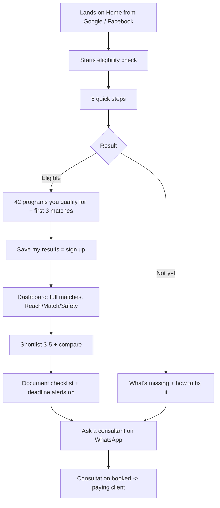
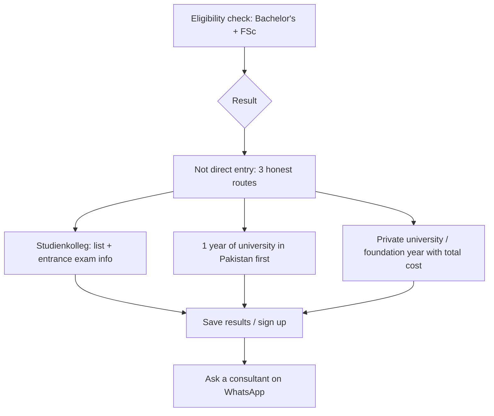
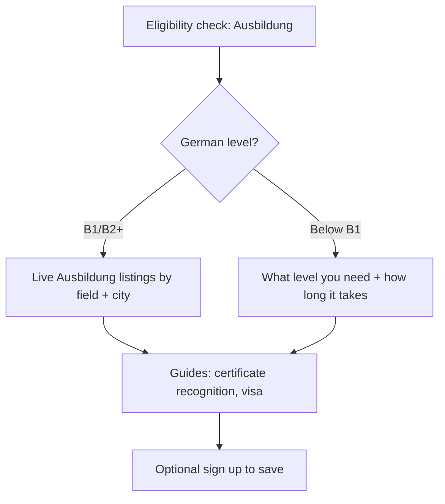
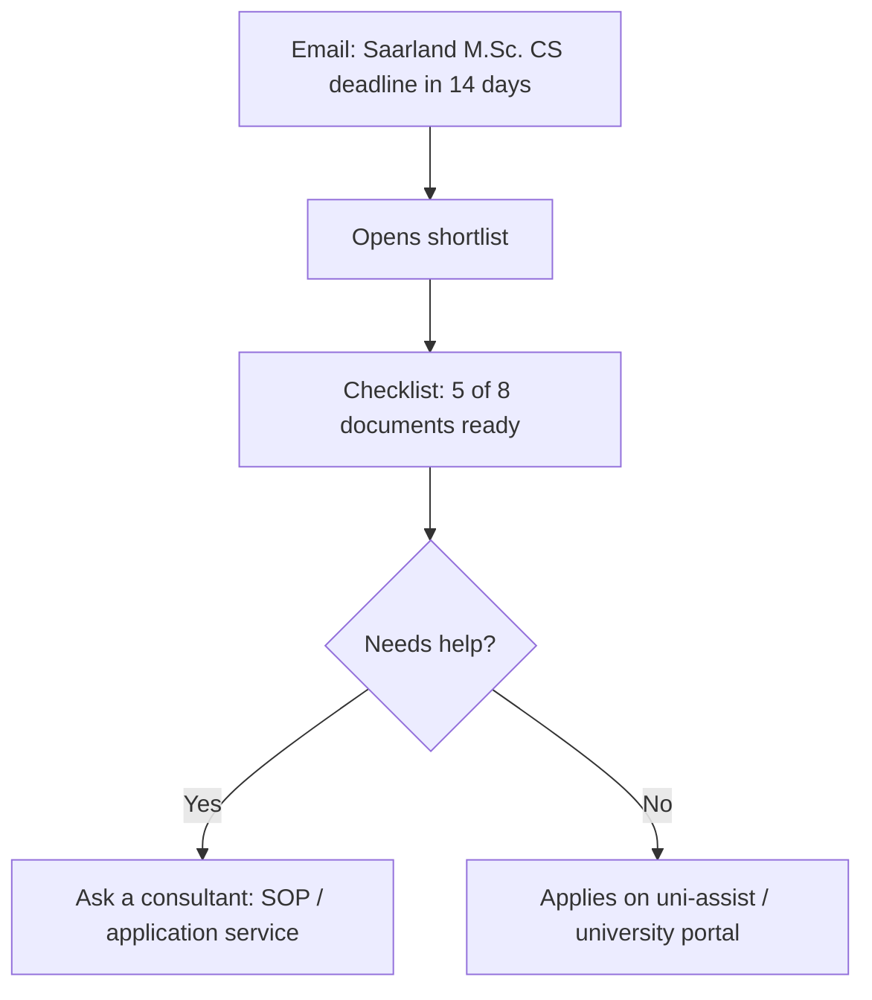
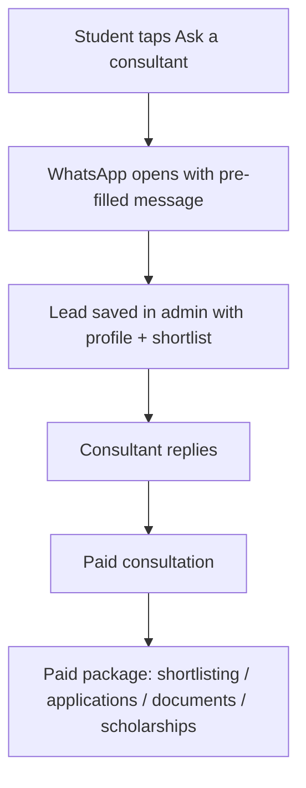
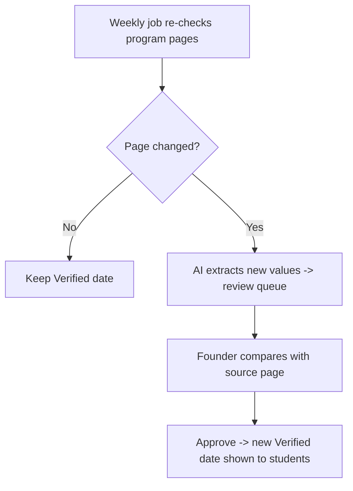

# Sitemap & User Flows (draft v1)

**Status:** Draft — open points at the bottom are decided in the Phase 3 grill-me.
**Based on:** PRD v1 (`../phases/prd.md`), design system v0.2, decisions #1–25.

## 0. Roles (decision #33)
Exactly **three roles** — no others.

| Role | Who | Access |
|---|---|---|
| **Visitor** | Not logged in | Public pages, eligibility check, top 3 matches, search, guides, tools, AI chat, WhatsApp |
| **Student** | Logged in (Google / email code) | Everything a visitor has + all matches, shortlist, compare, saved scholarships, checklists, alerts, profile |
| **Admin** | Founder | Everything, including all `/admin` pages |

## 1. Sitemap

### Public pages (no login, indexable by Google)
| Page | URL | Purpose |
|---|---|---|
| Home | `/` | Promise, eligibility check start, trust signals, how it works |
| Eligibility check | `/check` | 4–5 step questions, no sign-up |
| Eligibility result | `/check/result` | Honest answer + first 3 matches + next steps |
| Program search | `/programs` | Search + filters, "Show all" / "Only what I qualify for" |
| Program detail | `/programs/[university]/[program]` | Requirements, deadlines, documents, cost, source + verified date |
| University page | `/universities/[university]` | All programs at one university, city, type, costs |
| Compare | `/compare` | 3–5 programs side by side |
| Scholarships | `/scholarships` | Search + filters, honest odds |
| Scholarship detail | `/scholarships/[slug]` | Eligibility, amount, cycles, source + verified date |
| Ausbildung | `/ausbildung` | Ausbildung eligibility check + live listings (self-serve) |
| Guides | `/guides` + `/guides/[slug]` | APS, blocked account, visa, uni-assist, anabin, Studienkolleg |
| Grade converter | `/tools/grade-converter` | Pakistani grade → German grade |
| Cost calculator | `/tools/cost-calculator` | Tuition + semester fee + blocked account + living costs |
| How we verify | `/how-we-verify` | Explains sources, "last verified", Predicted vs Verified |
| About / Contact | `/about`, `/contact` | Team, consultancy, WhatsApp |
| Legal | `/privacy`, `/terms`, `/disclaimer` | GDPR, "we advise, universities decide" |

**Global on every page:** limited AI chat · floating WhatsApp button · top bar (desktop) / bottom tab bar (mobile).

### Account
| Page | URL |
|---|---|
| Sign up / Log in | `/signup`, `/login` |

### Dashboard (logged in, desktop sidebar)
| Page | URL | Purpose |
|---|---|---|
| Home | `/dashboard` | Eligibility status, shortlist + nearest deadlines, next steps, saved scholarships |
| Matches | `/dashboard/matches` | Reach / Match / Safety, live-updated from profile |
| Shortlist | `/dashboard/shortlist` | Saved programs + document checklist per program |
| Saved scholarships | `/dashboard/scholarships` | Saved scholarships + deadlines |
| Profile | `/dashboard/profile` | Education, language, preferences — each field unlocks matches |
| Alerts | `/dashboard/alerts` | Email deadline reminder settings |

### Admin (founder / team)
| Page | URL | Purpose |
|---|---|---|
| Programs | `/admin/programs` | Add / edit / approve programs |
| Scholarships | `/admin/scholarships` | Add / edit / approve scholarships |
| Review queue | `/admin/review` | Pages that changed this week + AI-extracted drafts |
| Leads | `/admin/leads` | Consultant handoffs with student profile + shortlist |
| Error reports | `/admin/reports` | "Report an error" submissions |

### Mobile bottom tab bar
| Tab | Logged out | Logged in |
|---|---|---|
| Home | `/` | `/dashboard` |
| Search | `/programs` | `/programs` |
| Matches | `/check` | `/dashboard/matches` |
| Scholarships | `/scholarships` | `/scholarships` |
| Profile | `/login` | `/dashboard/profile` |

## 2. Eligibility check steps
1. **What do you want to do?** Master's · Bachelor's · Ausbildung
2. **Your qualification** (depends on step 1)
   - Master's: 4-year BS / BSc (16 years) · 2-year BA/BSc (14 years) · 2-year BA/BSc + 2-year MA/MSc · Other
   - Bachelor's: FSc / HSSC (pre-engineering, pre-medical, ICS, ICom, FA) · A-levels · 1+ year of university completed · Other
   - Ausbildung: Matric · FSc / HSSC · Other
3. **Your grade** — CGPA or percentage (+ scale)
4. **Field** you want to study / train in
5. **Language** — English test + score (or "not taken yet") · German level (required for Ausbildung)

→ Result: one honest answer + reasons + next steps + first 3 matches + "Save my results" (sign-up) + WhatsApp.

## 3. User flows

### Flow A — Master's student, first visit (main flow)


### Flow B — FSc student → Bachelor's


### Flow C — Ausbildung seeker (self-serve)

No consultant handoff (decision #9).

### Flow D — Returning student, deadline alert


### Flow E — Consultant handoff


### Flow F — Founder verifies data (admin)


## 4. Decided (2026-10-04, decision #26)
- **Login:** Google sign-in + email one-time code. No passwords.
- **WhatsApp message:** pre-filled short summary (degree, grade, IELTS, target) + a private link to the student's profile and shortlist for the consultant.
- **"How we verify":** in the main navigation, and every "Verified" badge links to it.
- **Before sign-up:** result page shows the **top 3 matches + total count** ("42 programs you qualify for"); free sign-up to see all. Matching itself is never paywalled.

Example WhatsApp message:
```
Hi! I'd like help applying to Germany.
• Target: Master's in Computer Science
• Degree: 4-year BS, CGPA 3.2/4
• IELTS: 6.5
• Shortlist: 4 programs
Profile: https://<site>/p/abc123 (private link)
```
